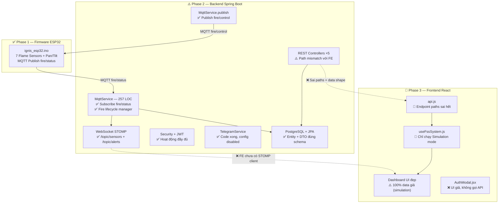
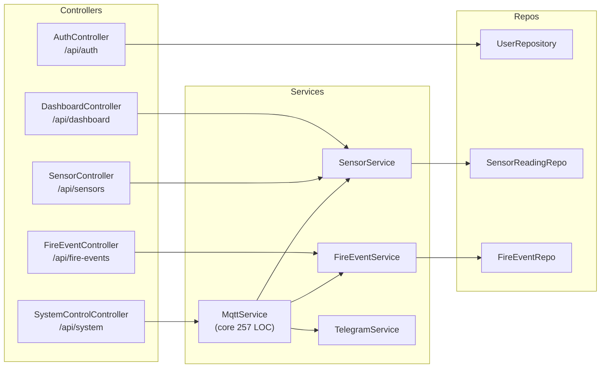
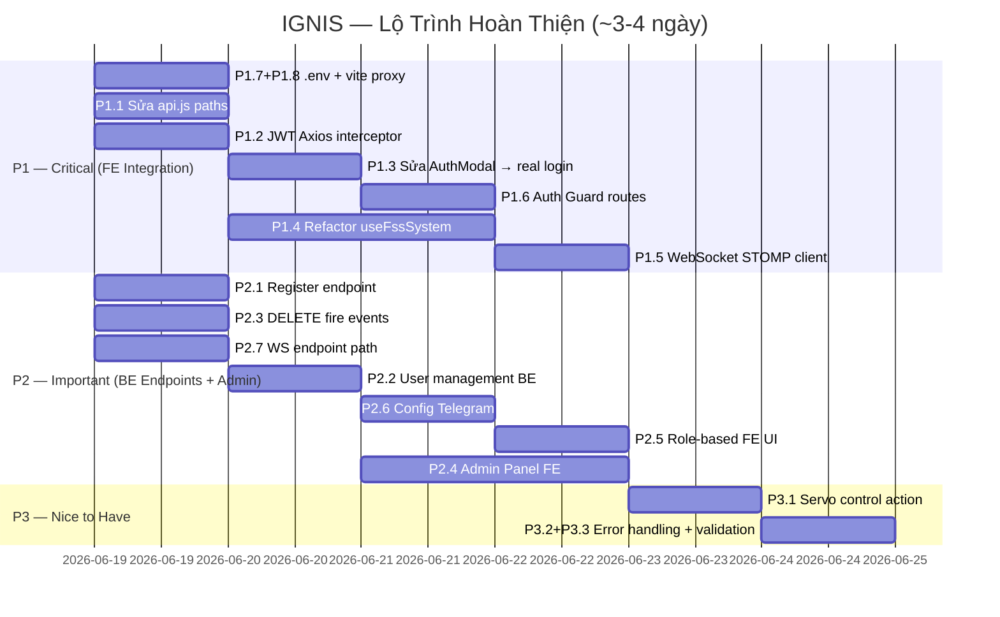
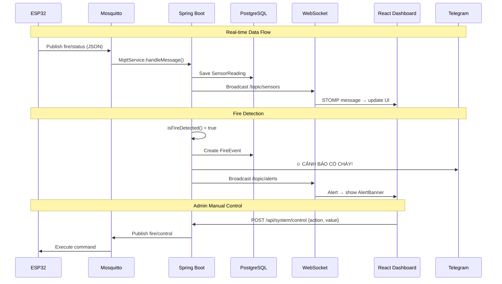

# 🔥 IGNIS Blueprint Plan — Phân Tích Hệ Thống & Kế Hoạch Hành Động

> Tài liệu tổng hợp kết quả rà soát toàn bộ hệ thống IGNIS (Backend + Frontend + Firmware)
> đối chiếu với [IGNIS_project_brief_v6.md](file:///d:/Project/IoT/fire-suppression-iot/IGNIS_project_brief_v6.md)
>
> **Ngày tạo:** 2026-06-19 | **Phiên bản:** 2.0

---

## 1. Tổng Quan Hiện Trạng



| Layer | Trạng thái | Mức hoàn thành |
|---|---|---|
| **Firmware ESP32** | ✅ Hoàn thành | 100% |
| **Backend Spring Boot** | ✅ Core IoT pipeline xong (MQTT→DB→WS→Telegram) | ~80% |
| **Frontend React** | 🔴 UI rất đẹp, nhưng KHÔNG kết nối backend | ~35% (UI shell + full simulation engine) |
| **Integration E2E** | ❌ Chưa hoạt động end-to-end | 0% |

> [!IMPORTANT]
> **Phát hiện quan trọng:** Backend đã hoàn thiện hơn nhiều so với ghi chú trong brief v6 — đã có DTOs, ApiResponse wrapper, stateful fire lifecycle, Telegram bot commands. Vấn đề chính nằm ở **Frontend chưa kết nối đúng cách** với Backend.

---

## 2. Phân Tích Backend — Kiến Trúc & API Endpoints

### 2.1 Kiến Trúc Backend Thực Tế



### 2.2 Tất Cả API Endpoints Hiện Có (Backend)

| # | Method | Path | Auth | Request | Response | Status |
|---|---|---|---|---|---|---|
| 1 | POST | `/api/auth/login` | Public | `LoginRequest {username, password}` | `ApiResponse<JwtResponse>` | ✅ |
| 2 | GET | `/api/dashboard/live-sensor` | JWT | — | `ApiResponse<SensorReadingDTO>` (latest 1) | ✅ |
| 3 | GET | `/api/dashboard/chart-data` | JWT | — | `ApiResponse<List<SensorReadingDTO>>` (latest 50) | ✅ |
| 4 | GET | `/api/sensors/latest?limit=N` | JWT | Query: `limit` (default 10) | `ApiResponse<List<SensorReadingDTO>>` | ✅ |
| 5 | POST | `/api/sensors` | JWT | `SensorReadingDTO` | `ApiResponse<SensorReadingDTO>` | ✅ |
| 6 | GET | `/api/fire-events` | JWT | — | `ApiResponse<List<FireEventDTO>>` | ✅ |
| 7 | POST | `/api/fire-events` | JWT | `FireEventDTO` | `ApiResponse<FireEventDTO>` | ✅ |
| 8 | POST | `/api/system/control` | JWT | `Map {action, value}` | `ApiResponse<String>` | ✅ |

### 2.3 WebSocket Topics (Real-time Push)

| Topic | Data | Trigger |
|---|---|---|
| `/topic/sensors` | `SensorReadingDTO` | Mỗi khi nhận MQTT từ ESP32 |
| `/topic/alerts` | `FireEventDTO` | Khi phát hiện lửa hoặc dập xong |

### 2.4 MQTT Topics

| Topic | Chiều | Mục đích |
|---|---|---|
| `fire/status` | ESP32 → Backend | Data cảm biến (Esp32StatusDTO) |
| `fire/control` | Backend → ESP32 | Lệnh điều khiển `{action, value}` |

### 2.5 DTOs Đã Có

| DTO | Fields |
|---|---|
| `ApiResponse<T>` | `success`, `message`, `data` — wrapper chuẩn cho mọi response |
| `LoginRequest` | `username`, `password` |
| `JwtResponse` | `token`, `username`, `role` |
| `SensorReadingDTO` | `id, recordedAt, sensorS0-S6, tiltSensor, panAngle, tiltAngle, pump, tempAmbient, tempObject` |
| `FireEventDTO` | `id, detectedAt, extinguishedAt, panAngle, tiltAngle, maxTemp, durationSeconds, triggeredSensors` |
| `Esp32StatusDTO` | `pan, tilt, sensors[], tilt_sensor, pump, temp_ambient, temp_object` |

### 2.6 Endpoints Còn Thiếu Theo Brief

| # | Chức năng | Brief yêu cầu | Hiện trạng BE |
|---|---|---|---|
| E1 | Đăng ký user (Admin) | ✅ | ❌ Không có endpoint `/api/auth/register` |
| E2 | Quản lý user (list/delete/update role) | ✅ | ❌ Không có |
| E3 | Xóa fire events | ✅ Admin only | ❌ Không có DELETE endpoint |
| E4 | System status tổng hợp | ✅ | ⚠️ Phân tán trong `/api/dashboard/*` |

---

## 3. Phân Tích Frontend ↔ Backend — Chi Tiết Mismatch

### 3.1 FE Chỉ Dùng 5 API Calls Thực Tế

> [!WARNING]
> Mặc dù `api.js` định nghĩa 10 functions, chỉ **5 hàm được gọi thực tế** trong code:

| API Function | Endpoint FE Gọi | BE Tương Đương | Trạng thái |
|---|---|---|---|
| `getDashboard()` | `GET /api/dashboard` | `GET /api/dashboard/live-sensor` | 🔴 **Sai path** (BE dùng sub-paths) |
| `postServo(pan, tilt)` | `POST /api/servo` | `POST /api/system/control` | 🔴 **Sai path + format** |
| `postPump(payload)` | `POST /api/pump` | `POST /api/system/control` | 🔴 **Sai path + format** |
| `postMode(auto)` | `POST /api/mode` | `POST /api/system/control` | 🔴 **Sai path + format** |
| `postAlert(level)` | `POST /api/alert` | ❌ Không tồn tại | 🔴 **Endpoint không có** |

**5 functions KHÔNG BAO GIỜ được gọi:** `getSensors`, `getSystemStatus`, `getServo`, `getPump`, `getLogs`

### 3.2 Data Structure Mismatch — CHI TIẾT

````carousel
### 🔴 GET /api/dashboard — Critical Mismatch

**FE kỳ vọng nhận được:**
```json
{
  "temp": 45.2,
  "pan": 90, "tilt": 45,
  "pumpOn": true,
  "pressure": "HIGH",
  "flowRate": 80,
  "waterL": 150,
  "waterUsed": 50,
  "alertLevel": 2,
  "sensors": {"s0": true, "s1": false, ...}
}
```

**BE thực tế trả về (từ `/api/dashboard/live-sensor`):**
```json
{
  "success": true,
  "message": "...",
  "data": {
    "id": 1,
    "recordedAt": "2026-06-18T...",
    "sensorS0": 1, "sensorS1": 0, ...,
    "tiltSensor": 1,
    "panAngle": 45.0,
    "tiltAngle": 75,
    "pump": true,
    "tempAmbient": 28.5,
    "tempObject": 150.2
  }
}
```

**Khác biệt:**
- BE wrap trong `ApiResponse` → phải truy cập `.data`
- Sensor keys: FE dùng `s0-s6: boolean`, BE dùng `sensorS0-sensorS6: int`
- Temperature: FE dùng `temp`, BE dùng `tempObject` + `tempAmbient`
- Pump: FE dùng `pumpOn`, BE dùng `pump`
- FE kỳ vọng `waterL, waterUsed, flowRate, pressure` — **BE không có** (những thứ này chỉ tồn tại trong simulation)

<!-- slide -->

### 🔴 POST Control Commands — Format Mismatch

**FE gửi (4 endpoints riêng biệt):**
```js
POST /api/servo  → {pan: 90, tilt: 45}
POST /api/pump   → {on: true, flowRate: 80, pressure: "HIGH"}
POST /api/mode   → {auto: true}
POST /api/alert  → {level: 2}
```

**BE nhận (1 endpoint duy nhất):**
```js
POST /api/system/control → {action: "pump", value: "on"}
POST /api/system/control → {action: "fullAuto", value: "on"}
POST /api/system/control → {action: "buzzer", value: "on"}
```

**Khác biệt:**
- FE dùng 4 endpoint riêng → BE chỉ có 1 endpoint `/api/system/control`
- FE gửi typed payload → BE nhận `{action: string, value: string}`
- BE hỗ trợ: `fullAuto`, `panAuto`, `pump`, `buzzer`
- FE kỳ vọng servo control riêng → BE không có action tương ứng

<!-- slide -->

### 🟡 Authentication — Hoàn Toàn Fake

**FE hiện tại (AuthModal.jsx):**
```
User nhập Email + Password
↓
setTimeout(700ms) — giả loading
↓
navigate('/dashboard') — KHÔNG gọi API
↓
Không lưu token, không gửi header
```

**BE yêu cầu:**
```
POST /api/auth/login {username, password}
↓
Trả về ApiResponse<JwtResponse> {token, username, role}
↓
Gắn Authorization: Bearer <token> vào mọi request
↓
BE filter check JWT trước khi cho truy cập protected endpoints
```

**Hệ quả:** Khi bật `USE_REAL_API=true`, mọi API call tới protected endpoints sẽ nhận 401/403 vì không có JWT token.
````

### 3.3 Frontend Features Inventory

| # | Tính năng | Brief yêu cầu | Hiện trạng FE | Gap |
|---|---|---|---|---|
| 1 | Landing page | — | ✅ Đẹp, có hero/features/stats/CTA | OK |
| 2 | Dashboard real-time | ✅ | ⚠️ Chạy simulation, UI rất đẹp | Cần kết nối WebSocket |
| 3 | Servo tracking map | ✅ | ✅ Component hoàn chỉnh | Cần data thật |
| 4 | Sensor panel (S0-S6) | ✅ | ✅ Component hoàn chỉnh | Cần data thật |
| 5 | Pump control | ✅ | ✅ Có toggle + pressure | Cần kết nối control API |
| 6 | Temperature display | ✅ | ✅ Có chart history | Cần data thật |
| 7 | Event timeline | ✅ | ✅ Component hoàn chỉnh | Cần data từ fire_events |
| 8 | Incidents history | ✅ | ✅ Có bảng + export CSV/JSON | Cần data thật |
| 9 | Analytics charts | — | ✅ Temp/Pan/Tilt history charts | Bonus, cần data thật |
| 10 | Manual servo control | ✅ Admin | ✅ ManualPane.jsx | Cần auth + control API |
| 11 | Login page | ✅ | ❌ Chỉ là UI giả | 🔴 Critical gap |
| 12 | JWT token handling | ✅ | ❌ Không có | 🔴 Critical gap |
| 13 | WebSocket real-time | ✅ | ❌ Không có STOMP client | 🔴 Critical gap |
| 14 | Admin panel (user mgmt) | ✅ | ❌ Không có | 🟡 Important gap |
| 15 | Auth guard (route protection) | ✅ | ❌ Không có | 🔴 Critical gap |
| 16 | Role-based UI (admin vs viewer) | ✅ | ❌ Không phân biệt | 🟡 Important gap |

---

## 4. Backend — Issues Còn Tồn Tại

| # | Vấn đề | Mức | File | Chi tiết |
|---|---|---|---|---|
| I1 | Không có `/api/auth/register` | 🟡 | — | Brief yêu cầu Admin tạo user, BE chưa có endpoint |
| I2 | Không có user management (list/delete) | 🟡 | — | Brief yêu cầu Admin quản lý user |
| I3 | Không có DELETE fire events | 🟡 | — | Brief yêu cầu Admin xóa lịch sử |
| I4 | JWT secret from properties | ✅ Đã OK | [JwtUtils.java](file:///d:/Project/IoT/fire-suppression-iot/back_end/src/main/java/com/fire/suppression/security/JwtUtils.java) | Đọc từ `jwt.secret` property |
| I5 | Package `com.fire.suppression` ≠ brief `com.ignis` | 🟢 Cosmetic | Toàn bộ BE | Không ảnh hưởng chức năng |
| I6 | Telegram disabled by default | 🟢 Đúng thiết kế | [application.properties](file:///d:/Project/IoT/fire-suppression-iot/back_end/src/main/resources/application.properties) | Cần config token + chatId |
| I7 | WebSocket endpoint là `/ws-fire-suppression` | ⚠️ | [WebSocketConfig.java](file:///d:/Project/IoT/fire-suppression-iot/back_end/src/main/java/com/fire/suppression/config/WebSocketConfig.java) | FE vite proxy trỏ `/ws` — cần thống nhất |
| I8 | `triggered_sensors` max 50 chars | ✅ OK | [FireEvent.java](file:///d:/Project/IoT/fire-suppression-iot/back_end/src/main/java/com/fire/suppression/entity/FireEvent.java) | Đủ chứa "s0,s1,s2,s3,s4,s5,s6" |

---

## 5. Kế Hoạch Hành Động — Phân Chia Theo Ưu Tiên

### 🔴 Priority 1 — CRITICAL (Phải xong trước demo)

> [!CAUTION]
> Không hoàn thành nhóm này = **không thể demo end-to-end**

| # | Task | Layer | Effort | Chi tiết |
|---|---|---|---|---|
| **P1.1** | **Sửa `api.js` — đổi toàn bộ endpoint paths** | FE | 🟢 1h | Xóa các endpoints không dùng. Đổi `GET /api/dashboard` → `GET /api/dashboard/live-sensor`. Gộp `postServo/postPump/postMode` → 1 hàm `postControl(action, value)` gọi `POST /api/system/control` |
| **P1.2** | **Thêm JWT interceptor vào Axios** | FE | 🟢 30 phút | Đọc token từ localStorage, gắn `Authorization: Bearer` header. Redirect về `/login` khi nhận 401 |
| **P1.3** | **Sửa `AuthModal.jsx` → gọi `POST /api/auth/login` thật** | FE | 🟡 1-2h | Gọi API thật, lưu JWT token + username + role vào localStorage/context |
| **P1.4** | **Refactor `useFssSystem.js` — Real API data mapping** | FE | 🔴 4-6h | Transform `ApiResponse<SensorReadingDTO>` → internal state format. Map `sensorS0` → `s0: boolean`, `tempObject` → `temp`, `pump` → `pumpOn`. Xử lý các fields FE cần nhưng BE không có (waterL, pressure → set default hoặc bỏ) |
| **P1.5** | **Thêm WebSocket STOMP client** | FE | 🟡 2-3h | Cài `@stomp/stompjs` + `sockjs-client`. Connect tới `/ws-fire-suppression` (khớp BE). Subscribe `/topic/sensors` + `/topic/alerts`. Thay thế polling bằng real-time push |
| **P1.6** | **Thêm Auth Guard cho route `/dashboard`** | FE | 🟢 30 phút | `ProtectedRoute` wrapper kiểm tra JWT token, redirect `/login` nếu chưa đăng nhập |
| **P1.7** | **Tạo file `.env` cho FE** | FE | 🟢 10 phút | `VITE_API_BASE_URL=http://localhost:8080`, `VITE_USE_REAL_API=true`, `VITE_POLL_INTERVAL=5000` |
| **P1.8** | **Uncomment proxy trong `vite.config.js`** | FE | 🟢 5 phút | Bật proxy `/api` → `localhost:8080` và `/ws-fire-suppression` → ws |

### 🟡 Priority 2 — IMPORTANT (Nên có cho demo đầy đủ điểm)

| # | Task | Layer | Effort | Chi tiết |
|---|---|---|---|---|
| **P2.1** | **Thêm `POST /api/auth/register` endpoint** | BE | 🟡 1h | ADMIN only, nhận `{username, password}`, default role = "viewer" |
| **P2.2** | **Thêm User Management endpoints** | BE | 🟡 2h | `GET /api/users` (ADMIN), `DELETE /api/users/{id}` (ADMIN), `PUT /api/users/{id}/role` (ADMIN) |
| **P2.3** | **Thêm DELETE fire events endpoints** | BE | 🟢 30 phút | `DELETE /api/fire-events/{id}`, `DELETE /api/fire-events` — ADMIN only |
| **P2.4** | **Tạo Admin Panel page** | FE | 🟡 3-4h | Route `/admin`, tabs: User Management + Event Management. Chỉ Admin truy cập |
| **P2.5** | **Phân quyền UI theo role** | FE | 🟡 1-2h | Lưu role từ JWT, ẩn control buttons với Viewer, hiện Admin panel link với Admin |
| **P2.6** | **Config Telegram Bot** | BE | 🟢 30 phút | Tạo bot qua @BotFather, điền token + chatId vào properties |
| **P2.7** | **Thống nhất WebSocket endpoint path** | BE+FE | 🟢 15 phút | Chọn 1: đổi BE thành `/ws` hoặc FE proxy thành `/ws-fire-suppression` |

### 🟢 Priority 3 — NICE TO HAVE (Cải thiện chất lượng)

| # | Task | Layer | Effort | Chi tiết |
|---|---|---|---|---|
| **P3.1** | Thêm servo control action vào BE | BE | 🟡 1h | MqttService hỗ trợ action `servo` → publish `{"action":"servo","value":"pan:90,tilt:45"}` |
| **P3.2** | Global error handling (ControllerAdvice) | BE | 🟡 1h | Thêm `@ControllerAdvice` + `@ExceptionHandler` |
| **P3.3** | Validation annotations | BE | 🟢 30 phút | `@NotBlank`, `@Size` trên DTOs |
| **P3.4** | FE Toast notifications cho API errors | FE | 🟡 1h | Thay `console.error` bằng toast UI |
| **P3.5** | FE Loading states + skeleton UI | FE | 🟡 1h | Loading spinner khi chờ API |
| **P3.6** | Đổi package `com.fire.suppression` → `com.ignis` | BE | 🟡 2h | Theo brief, refactor toàn bộ |
| **P3.7** | Thêm pagination cho sensors/events | BE | 🟡 1h | Hỗ trợ `?page=0&size=20` |

---

## 6. Lộ Trình Thực Hiện Đề Xuất



---

## 7. Luồng Integration Mục Tiêu (Sau Khi Sửa)



---

## 8. Checklist Xác Minh Trước Demo

| # | Kiểm tra | Category | Brief Ref |
|---|---|---|---|
| ☐ | Docker containers (PostgreSQL + Mosquitto) khởi động OK | Infra | — |
| ☐ | ESP32 → MQTT `fire/status` → Spring Boot `MqttService` nhận data | IoT Pipeline | F1 |
| ☐ | Data lưu vào `sensor_readings` table đúng schema | Backend | F1 |
| ☐ | Fire event tự detect (any sensor=1 OR tempObject>55°C) | Backend | F1 |
| ☐ | WebSocket push `/topic/sensors` + `/topic/alerts` | Backend | F2 |
| ☐ | Telegram gửi alert khi phát hiện + dập xong lửa | Backend | F3 |
| ☐ | FE `.env` set `VITE_USE_REAL_API=true` | FE Config | — |
| ☐ | FE Login page gọi `/api/auth/login`, lưu JWT token | FE Auth | F4 |
| ☐ | FE Dashboard hiển thị data thật từ BE (không simulation) | FE Data | Phase 3 |
| ☐ | FE WebSocket nhận data real-time (không polling) | FE Real-time | F2 |
| ☐ | Admin thấy control panel + manual servo/pump | FE Authz | Phân quyền |
| ☐ | Viewer chỉ xem, không thấy control buttons | FE Authz | Phân quyền |
| ☐ | Admin điều khiển pump ON → ESP32 bật bơm | E2E Control | F6 |
| ☐ | Event history hiển thị đúng từ DB | FE Data | Phase 3 |
| ☐ | Demo live ổn định hoặc có video backup | Demo | Phase 4 |

---

## 9. Tổng Kết Rủi Ro

| Rủi ro | Mức | Giải pháp |
|---|---|---|
| **FE ↔ BE endpoint paths hoàn toàn sai** | 🔴 | P1.1 — refactor `api.js` |
| **FE data shape khác BE response shape** | 🔴 | P1.4 — data mapping layer |
| **FE không có auth thật** | 🔴 | P1.2 + P1.3 + P1.6 |
| **FE không có WebSocket** | 🔴 | P1.5 — thêm STOMP client |
| **FE chạy 100% simulation mặc định** | 🟡 | P1.7 — set `VITE_USE_REAL_API=true` |
| WS endpoint path mismatch (`/ws` vs `/ws-fire-suppression`) | 🟡 | P2.7 — thống nhất |
| BE thiếu register + user management | 🟡 | P2.1 + P2.2 |
| Telegram chưa config | 🟡 | P2.6 |
| Proxy disabled trong vite.config.js | 🟢 | P1.8 |

> [!WARNING]
> **Rủi ro #1:** Frontend đang chạy **100% simulation data** mặc định (`VITE_USE_REAL_API=false`). Dashboard hiển thị data giả rất đẹp nhưng **không phản ánh thực tế nào từ ESP32/Backend**. Đây là vấn đề lớn nhất cần giải quyết.

---

## Appendix A — File Reference Map

### Backend Files (Package: `com.fire.suppression`)

| Category | File | Lines | Chức năng |
|---|---|---|---|
| Entry | [SuppressionApplication.java](file:///d:/Project/IoT/fire-suppression-iot/back_end/src/main/java/com/fire/suppression/SuppressionApplication.java) | ~30 | Main + default admin seed |
| Controller | [AuthController.java](file:///d:/Project/IoT/fire-suppression-iot/back_end/src/main/java/com/fire/suppression/controller/AuthController.java) | — | Login |
| Controller | [DashboardController.java](file:///d:/Project/IoT/fire-suppression-iot/back_end/src/main/java/com/fire/suppression/controller/DashboardController.java) | — | Live sensor + chart data |
| Controller | [SensorController.java](file:///d:/Project/IoT/fire-suppression-iot/back_end/src/main/java/com/fire/suppression/controller/SensorController.java) | — | Sensor readings CRUD |
| Controller | [FireEventController.java](file:///d:/Project/IoT/fire-suppression-iot/back_end/src/main/java/com/fire/suppression/controller/FireEventController.java) | — | Fire events list + create |
| Controller | [SystemControlController.java](file:///d:/Project/IoT/fire-suppression-iot/back_end/src/main/java/com/fire/suppression/controller/SystemControlController.java) | — | MQTT control commands |
| Service | [MqttService.java](file:///d:/Project/IoT/fire-suppression-iot/back_end/src/main/java/com/fire/suppression/service/MqttService.java) | 257 | **Core** — MQTT handler + fire lifecycle |
| Service | [SensorService.java](file:///d:/Project/IoT/fire-suppression-iot/back_end/src/main/java/com/fire/suppression/service/SensorService.java) | — | Sensor data persistence |
| Service | [FireEventService.java](file:///d:/Project/IoT/fire-suppression-iot/back_end/src/main/java/com/fire/suppression/service/FireEventService.java) | — | Fire event CRUD + update |
| Service | [TelegramService.java](file:///d:/Project/IoT/fire-suppression-iot/back_end/src/main/java/com/fire/suppression/service/TelegramService.java) | — | Bot + /control command |
| Config | [MqttConfig.java](file:///d:/Project/IoT/fire-suppression-iot/back_end/src/main/java/com/fire/suppression/config/MqttConfig.java) | — | MQTT broker connection |
| Config | [SecurityConfig.java](file:///d:/Project/IoT/fire-suppression-iot/back_end/src/main/java/com/fire/suppression/config/SecurityConfig.java) | — | JWT security + CORS |
| Config | [WebSocketConfig.java](file:///d:/Project/IoT/fire-suppression-iot/back_end/src/main/java/com/fire/suppression/config/WebSocketConfig.java) | — | STOMP /ws-fire-suppression |
| Config | [TelegramBotConfig.java](file:///d:/Project/IoT/fire-suppression-iot/back_end/src/main/java/com/fire/suppression/config/TelegramBotConfig.java) | — | Bot registration |
| Security | [JwtUtils.java](file:///d:/Project/IoT/fire-suppression-iot/back_end/src/main/java/com/fire/suppression/security/JwtUtils.java) | — | JWT generate/validate |
| Security | [JwtAuthenticationFilter.java](file:///d:/Project/IoT/fire-suppression-iot/back_end/src/main/java/com/fire/suppression/security/JwtAuthenticationFilter.java) | — | JWT filter chain |
| Security | [UserDetailsServiceImpl.java](file:///d:/Project/IoT/fire-suppression-iot/back_end/src/main/java/com/fire/suppression/security/UserDetailsServiceImpl.java) | — | User details loader |
| DTO | [ApiResponse.java](file:///d:/Project/IoT/fire-suppression-iot/back_end/src/main/java/com/fire/suppression/dto/ApiResponse.java) | — | Generic response wrapper |
| DTO | [SensorReadingDTO.java](file:///d:/Project/IoT/fire-suppression-iot/back_end/src/main/java/com/fire/suppression/dto/SensorReadingDTO.java) | — | Sensor data transfer |
| DTO | [FireEventDTO.java](file:///d:/Project/IoT/fire-suppression-iot/back_end/src/main/java/com/fire/suppression/dto/FireEventDTO.java) | — | Fire event transfer |
| DTO | [Esp32StatusDTO.java](file:///d:/Project/IoT/fire-suppression-iot/back_end/src/main/java/com/fire/suppression/dto/Esp32StatusDTO.java) | — | MQTT payload mapping |
| Properties | [application.properties](file:///d:/Project/IoT/fire-suppression-iot/back_end/src/main/resources/application.properties) | — | DB + MQTT + JWT + Telegram config |

### Frontend Files (fss-dashboard)

| Category | File | Chức năng | API Calls |
|---|---|---|---|
| Config | [vite.config.js](file:///d:/Project/IoT/fire-suppression-iot/fss-dashboard/vite.config.js) | Dev server + proxy (disabled) | — |
| Config | [package.json](file:///d:/Project/IoT/fire-suppression-iot/fss-dashboard/package.json) | Dependencies | — |
| API | [api.js](file:///d:/Project/IoT/fire-suppression-iot/fss-dashboard/src/services/api.js) | 🔴 Axios endpoints (sai paths) | 10 functions |
| Core Hook | [useFssSystem.js](file:///d:/Project/IoT/fire-suppression-iot/fss-dashboard/src/hooks/useFssSystem.js) | 🔴 State + simulation engine (461 LOC) | getDashboard, postServo/Pump/Mode/Alert |
| Context | [FssContext.jsx](file:///d:/Project/IoT/fire-suppression-iot/fss-dashboard/src/context/FssContext.jsx) | React context provider | — |
| Routing | [AppRoutes.jsx](file:///d:/Project/IoT/fire-suppression-iot/fss-dashboard/src/routes/AppRoutes.jsx) | `/` + `/dashboard` | — |
| Page | [DashboardPage.jsx](file:///d:/Project/IoT/fire-suppression-iot/fss-dashboard/src/pages/Dashboard/DashboardPage.jsx) | Dashboard layout | — |
| Page | [LandingPage.jsx](file:///d:/Project/IoT/fire-suppression-iot/fss-dashboard/src/pages/Landing/LandingPage.jsx) | Landing + fake auth modal | — |
| Utils | [kpi.js](file:///d:/Project/IoT/fire-suppression-iot/fss-dashboard/src/utils/kpi.js) | KPI calculations | — |
| Utils | [exporters.js](file:///d:/Project/IoT/fire-suppression-iot/fss-dashboard/src/utils/exporters.js) | CSV/JSON export | — |

### Infrastructure

| File | Chức năng |
|---|---|
| [docker-compose.yml](file:///d:/Project/IoT/fire-suppression-iot/docker-compose.yml) | PostgreSQL (5432) + Mosquitto (1883) |
| [docker-compose.yml (backend)](file:///d:/Project/IoT/fire-suppression-iot/back_end/docker-compose.yml) | PostgreSQL (5433) + Mosquitto (1883) |
| [Postman Collection](file:///d:/Project/IoT/fire-suppression-iot/back_end/IGNIS_API.postman_collection.json) | API test collection v2 |
